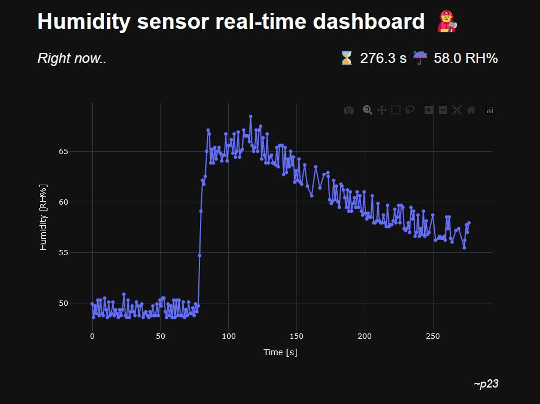

# Sensor dashboard

A simple serial real-time dashboard made with [click](https://click.palletsprojects.com/en/8.1.x/) and [dash](https://plotly.com/dash/).

## Setup
To create the environment:

`conda env create -f env.yml`

Then activate it with:

`conda activate sensordashboard`

## Running

You are expected to specify the serial device address.
Find your device name (say `COM3`), move to the installation folder and launch with:

`python main.py --dev=COM3`

The terminal will meet you with a localhost address, write it in a browser url bar or `ctrl+click` it. 
Logs are saved in CSV format in the `output` subdirectory of the installation folder.

## Uninstalling

`conda remove --name sensordashboard --all`

Should do.

## Screenshot

